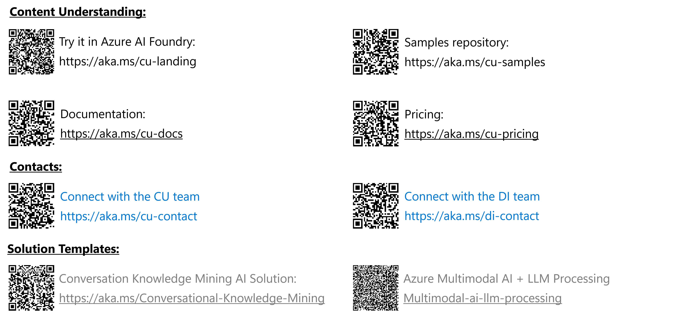

# Azure AI Document Intelligence & Content Understanding Expert Booth Material
This is the main folder for Azure AI Document Intelligence and Azure AI Content Understanding content for BUILD '25.

## Recently announced features or updates

### Document Intelligence
- [Documentation](https://learn.microsoft.com/en-us/azure/ai-services/document-intelligence/?view=doc-intel-4.0.0)
- [Batch API](https://learn.microsoft.com/en-us/azure/ai-services/document-intelligence/concept-batch-analysis?view=doc-intel-4.0.0)
- [Read/Prebuild/Custom models via Document Intelligence Studio](https://learn.microsoft.com/en-us/azure/ai-services/document-intelligence/studio-overview?view=doc-intel-4.0.0&tabs=di-studio)

### Content Understanding
- Pro mode: Pro mode, currently limited to documents, is designed for scenarios where content understanding needs to go beyond surface-level extraction—ideal for use cases that traditionally require postprocessing, human review and decision-making based on multiple data points and contextual references.
- Structured Document Outputs: Improved handling of tables spanning multiple pages, recognition of selection marks, and support for additional file types like .rtf, .xml, .csv, .msg, and .eml.
- Classifier API: Automatically categorize/split and route documents to appropriate processing pipelines.
- Video Analysis: Extract data across an entire video or break a video into  chapters automatically. Enrich metadata with face identification and descriptions that include facial images.
- Audio Understanding: Multi-speaker detection to identify roles in conversations, enhancing analysis in call center and meeting scenarios.
- Face API Preview: Detect, recognize, and enroll faces, enabling richer user-aware applications.

## Booth Content

- [Overview Slides](./Build25CU+DIExpert Booth.pptx)
- [FAQ for BUILD '25](./faq.md)

## Quick Links to share

## Demos

### Content Understanding

Content Understanding can be presented either through [Foundry Portal](https://ai.azure.com) or via the provided python samples repos.

#### Python Samples

The following sample repos provide ready to use sample notebooks for preview.1 API status.
They can easily be run locally or in Github codespaces.

[Azure Content Understanding General Samples](https://github.com/Azure-Samples/azure-ai-content-understanding-python)

[Azure Search with Content Understanding](https://github.com/Azure-Samples/azure-ai-search-with-content-understanding-python)

[Azure Content Understanding with OpenAI](https://github.com/Azure-Samples/azure-ai-content-understanding-with-azure-openai-python)

#### Sample Data

You can find sample data for all modalities in the [data](./data/) folder.

## Learning Resources incl. Videos

[Document Intelligence Documentation](https://learn.microsoft.com/azure/ai-services/document-intelligence)

[Content Understanding Documentation](https://learn.microsoft.com/azure/ai-services/content-understanding/)

[Learn Video Series - Multimodal data processing with Azure AI Content Understanding](https://learn.microsoft.com/en-us/shows/multimodal-data-processing-with-azure-ai-content-understanding/)

[Learning Path - Analyze content with Azure AI Content Understanding](https://learn.microsoft.com/training/modules/analyze-content-ai/)

## Blogs

[Preview.2 Announcement Blog](TBD Monday)

[Learn Video Series - Announcement Blog](https://techcommunity.microsoft.com/blog/Azure-AI-Services-blog/introducing-azure-ai-content-understanding-for-beginners/4413071)
